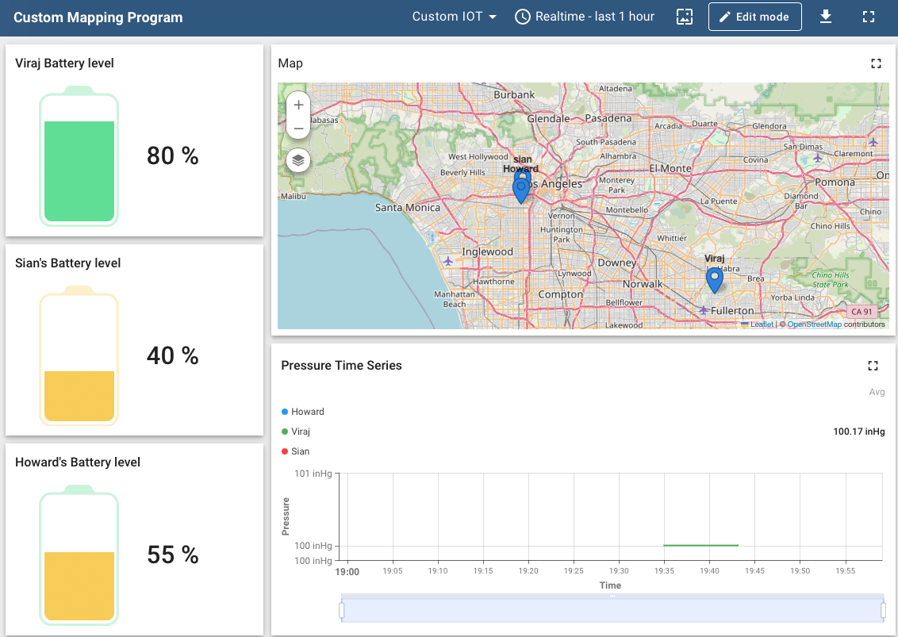

<!--
	***
	*   README.md
	*
	*	Author: Jeong Hoon (Sian) Choi
	*	License: MIT
	*
	***
-->

<a name="readme-top"></a>

<br/>
<div align="center">
	<a href="https://github.com/csian98/cloud-iot-hub">
		
	</a>
	<h3 align="center">Cloud IoT Hub</h3>	
	<br/>
	<a href="https://github.com/csian98/cloud-IoT-hub">
		<strong>Explore the docs »</strong>
	</a>
<br/>
<br/>
<a href="https://github.com/csian98/cloud-IoT-hub/issues/new?labels=bug&template=bug-report---.md">Report Bug</a>
·
<a href="https://github.com/csian98/cloud-IoT-hub/issues/new?labels=enhancement&template=feature-request---.md">Request Feature</a>
</p>
</div>
	


## Installation

### Java 17
``` sh
sudo apt-get update && sudo apt-get install openjdk-17-jdk
sudo update-alternatives --config java
```

### PostgreSQL
``` sh
sudo apt=get install -y postgresql-common
sudo /usr/share/postgresql-common/pgdg/apt.postgresql.org.sh
sudo systemctl restart postgresql
```

### ThingsBoard
``` sh
wget https://github.com/thingsboard/thingsboard/releases/download/v4.3.0.1/thingsboard-4.3.0.1.deb
sudo dpkg -i thingsboard-4.3.0.1.deb
```

## 🔐 License

Copyright © 2026, All rights reserved Distributed under the MIT License.
See `LICENSE` for more information.

<p align="right">(<a href="#readme-top">back to top</a>)</p>
